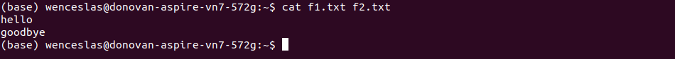

# README - PROJET LINUX 2019

## Objectif 

Ce readme a pour but de documenter le projet et d’expliquer le fonctionnement des différentes versions du script.

# SCRIPT : Première version

## Objectif

- Souhaiter la bienvenue à l’utilisateur 
- Indiquer la date d’utilisation
- Lire le chemin d’un répertoire indiqué par l’utilisateur
- Afficher le répertoire en question

## Exemple

*J’utiliserai pour l’exemple une copie de la première version du script, sauvegardée dans le dossier utilisateur.*

Je cherche à afficher le contenu du dossier **anaconda3** 

- Je fais appel à mon script.
- Je lui indique le chemin du répertoire désiré. Comme le dossier **anaconda3** se trouve au même endroit que mon script, on peut écrire le chemin de plusieurs manières (absolu ou relatif).

# SCRIPT : Deuxième version

## Objectif

- Prendre en paramètre un pattern
- Souhaiter la bienvenue à l’utilisateur 
- Indiquer la date d’utilisation
- Lire le chemin d’un répertoire indiqué par l’utilisateur
- Afficher les fichiers du répertoire en question, dont le nom respecte le pattern

## Exemple

*J’utiliserai pour l’exemple une copie de la deuxième version du script, sauvegardée dans le dossier utilisateur.*

Je cherche à afficher les fichiers du dossier utilisateur commençant par la lettre f.

- Je fais appel à mon script avec le pattern f* en paramètre.
- Je lui indique le chemin du répertoire désiré : le dossier utilisateur. Comme le script se trouve dans le dossier utilisateur, on peut écrire le chemin de plusieurs manières (absolu ou relatif).

# SCRIPT : Troisième version

## Objectif

- Prendre deux paramètres : pattern de nom de fichier, pattern de contenu de fichier
- Souhaiter la bienvenue à l’utilisateur 
- Indiquer la date d’utilisation
- Lire le chemin d’un répertoire indiqué par l’utilisateur
- Afficher les fichiers du répertoire en question, dont le nom et le contenu respectent les patterns respectifs.

## Exemple

*J’utiliserai pour l’exemple une copie de la troisième version du script, sauvegardée dans le dossier utilisateur.*

Je cherche à afficher les fichiers du dossier utilisateur commençant par la lettre f et contenant certains patterns.

Voici le contenu de mes fichiers **f1.txt** et **f2.txt**

- Je fais appel à mon script avec le pattern f* pour le nom de fichier, et différents patterns pour le contenu du fichier.
- Je lui indique le chemin du répertoire désiré : le dossier utilisateur. Comme le script se trouve dans le dossier utilisateur, on peut écrire le chemin de plusieurs manières (absolu ou relatif).

